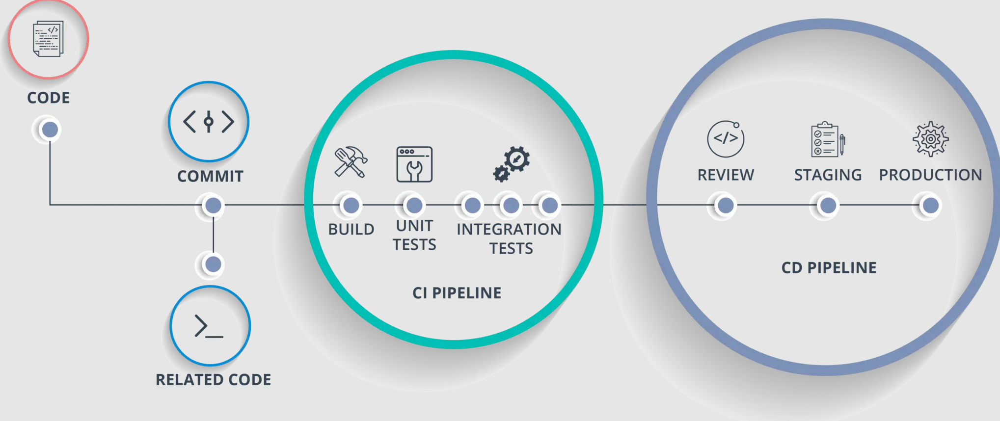

### - Applications used (with links).
O aplicativo base utilizado nas validações foi o OWASP VulnerableApp (https://github.com/SasanLabs/VulnerableApp),
Uma aplicação propositalmente vulnerável adotada como alvo dos scans. Ele reúne cenários típicos de SAST, SCA e DAST e é bem alinhada com este desafio, permitindo reproduzir e evidenciar vulnerabilidades.

### - Tools selected for SAST, DAST, SCA (why chosen + links)
SAST – Semgrep: rápido, boa cobertura por regras comunitárias, integração simples com CI e exporta SARIF para code scanning. https://semgrep.dev/

SCA – OWASP Dependency-Check: detecta CVEs em dependências, integra NVD e gera JSON/HTML/SARIF. https://github.com/dependency-check/DependencyCheck

DAST – OWASP ZAP: baseline para PR (rápido, não intrusivo) e full/active em QA/Release; ideal para validar o app em execução. https://www.zaproxy.org/ e ghcr.io/zaproxy/zaproxy:stable

### - Steps to reproduce scans.
Via GitHub Actions
SAST/SCA: faça um commit para main ou dispare manualmente o workflow security-analysis.yml (Actions → Run workflow).
Artefatos: relatórios Semgrep (semgrep-report) e Dependency-Check (dc-security-reports).

DAST: dispare o workflow security-dynamic-analysis.yml (job dast).
O job sobe a VulnerableApp em http://localhost:9090/VulnerableApp e roda o ZAP Baseline.

### - Include a diagram showing how and where each tool fits in the pipeline.

A cada commit, o CI aciona os jobs de segurança. Na etapa de Build/Testes, executamos Semgrep (SAST) para encontrar padrões de código inseguros e Dependency-Check (SCA) para identificar CVEs em dependências. Ambos rodam rápido, funcionam bem em PR e permitem gates objetivos. Assim, possíveis vulnerabilidades entram no radar antes do merge, com custo de correção menor e melhor rastreabilidade. Com a aplicação em execução, validamos comportamento com OWASP ZAP (DAST) em Review/Preview e Staging/Release no ciclo CI/CD. 

### 1) PR / Commit (Prevenção imediata)

-   **Semgrep (SAST)**    
    -   **Objetivo:** realizar análise estática para detectar vulnerabilidades de código (ex.: injeção de SQL, XSS, uso inseguro de APIs) antes que sejam incorporadas ao branch principal (main/production/release).       
    -   **Disparo típico:** em Pull Request (rápido).        
    -   **Saída:** `semgrep-report.json.json`     
    -   **Gate recomendado:** falhar PR se houver High/Critical.
        
-   **Dependency-Check (SCA)**    
    -   **Objetivo:** identificar vulnerabilidades (CVEs) em bibliotecas e frameworks utilizados, garantindo que a aplicação não dependa de componentes inseguros.  reduz risco de exploração via cadeia de dependências.    
    -   **Disparo típico:** no mesmo job da PR.        
    -   **Saída:** `dependency-check-report.json`.        
    -   **Gate recomendado:** bloquear se **CVSS ≥ 7**.    
    -   **Boas práticas:** Utilizar chave `NVD_API_KEY` para acelerar atualização do banco de CVEs. Incluir a chave no Secret do Github (Similar ao que foi feito no YML)
        

### 2) Build / Preview (Validação comportamental)

-   **OWASP ZAP (DAST)**    
    -   **Objetivo:** executar análise dinâmica contra a aplicação em execução, identificando vulnerabilidades exploráveis via interface web, como falhas de autenticação, configurações inseguras, ausência de headers de segurança e entradas vulneráveis.
    -   **Disparo típico:** job separado (`dast`) após subir a aplicação.        
    -   **Saída:** dast-report.html.        
    -   **Gate recomendado:** Em PRs, utilizar o modo baseline (rápido, não intrusivo) e abrir tickets automáticos para findings críticos, sem necessariamente bloquear merge. Em branch de release ou produção, executar full scan (ativo e mais profundo) e requistar bloqueio de deploy se houver vulnerabilidades críticas reproduzíveis.

### - Provide recommendations for automating findings triage and reporting
De uma forma geral, podemos recomendar para a maioria dos times:
padronização de artefatos: SAST em SARIF e SCA/DAST em JSON/HTML, fazendo a ingestão destes artefatos em ferramentas como DefectDojo com baseline e deduplicação. classificar automaticamente a ingestão por severidade (CVSS), abrir tickets automaticamente (Jira/GitHub Issues) mapeando via CODEOWNERS e notificando os responsáveis via Teams/Slack com evidências e localização.

### - Address considerations for Model Context Protocol (MCP) and secure scaling
O Model Context Protocol (MCP) é um barramento padronizado que conecta agentes e modelos a dados e ações, usando contratos tipados. Um cliente MCP pode descobrir e consumir diversos recursos, como relatórios SARIF e CycloneDX, além de outros artefatos já mencionados neste desafio. Com esses dados, novas ferramentas são acionadas através do próprio MCP. Para garantir a segurança, é essencial considerar o escopo mínimo para cada operação e implementar medidas contra prompt injection. Além disso, é crucial ter revisão humana, isolamento por meio de um sandbox, controle de saída (egress control), limite de chamadas (rate limit) e a adoção de padrões gerais de anti-abuso.

Para um escalonamento seguro no CI/CD, priorize runners efêmeros e ambientes isolados que não contenham segredos de longa duração. Garanta a segurança da cadeia de suprimentos (supply chain) com um CycloneDX para cada artefato, assinatura com Cosign e policy gates para cada etapa de homologação e produção. Monitore com alertas de SLA violado, use caches NVD para melhorar o desempenho e tenha um plano de DR/HA (recuperação de desastres e alta disponibilidade) para fallback local dos gates, caso eles fiquem indisponíveis.

### - Include security considerations for AI/ML-based features in applications.
De forma geral devemos analisar alguns ataques como:
- Prompt/Indirect Prompt Injection (user ou RAG) 
- Exposição de dados (PII/segredos) 
- Abuso de endpoint (DoS/custos)
- Contaminação dos dados de treino
- Vazamento de Modelo, entre outros.

Para proteger features de IA/ML, hardening de entradas e saídas com prompt templates rígidos, sanitize conteúdo de RAG,  bloquear logs e propagação de PII/segredos. No uso de ferramentas/MCP, aplique o principio do menor privilegio, OIDC para identidade efêmera, aprovação humana para operações destrutivas ou de alto impacto. Implemente rate limiting/quotas, timeouts, orçamentos de tokens e caching contra abuso/custos. exija assinatura/verificação de modelos e contêineres (Cosign), gere SBOM (incluindo tokenizer/embeddings). No RAG, use ACL por chunk/tenant. Por fim, mantenha observabilidade e auditoria com traceparent e detecção de anomalias.

